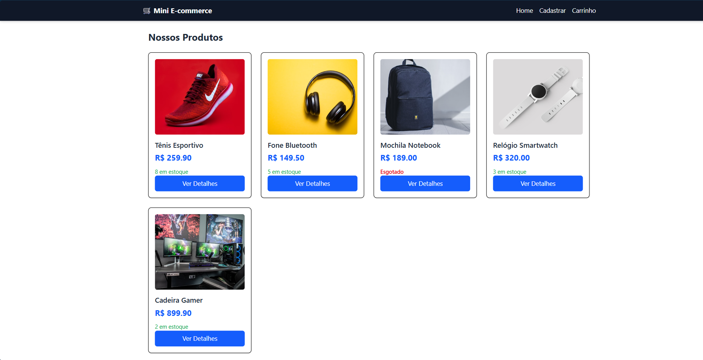
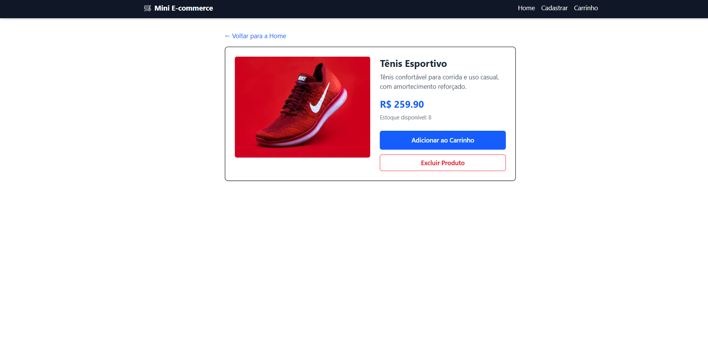
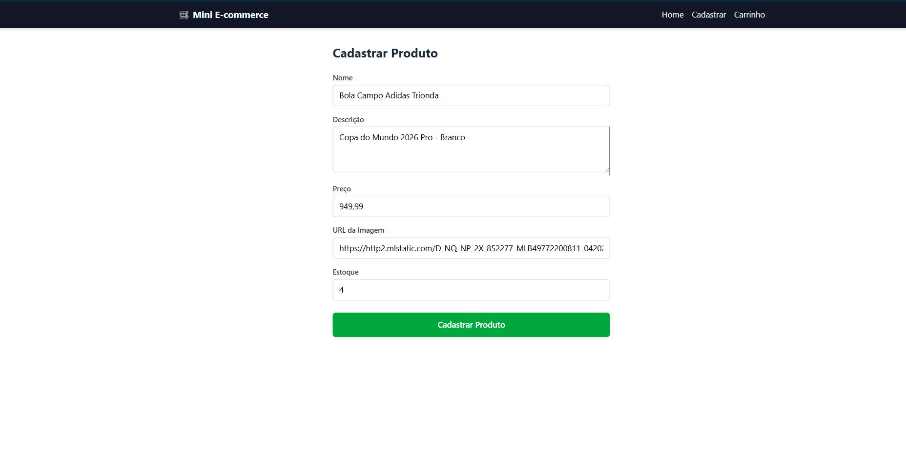
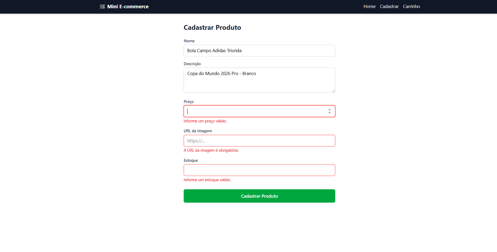
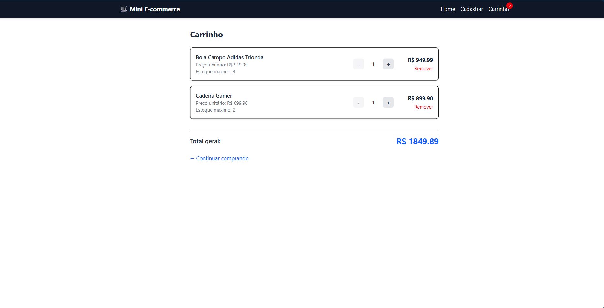
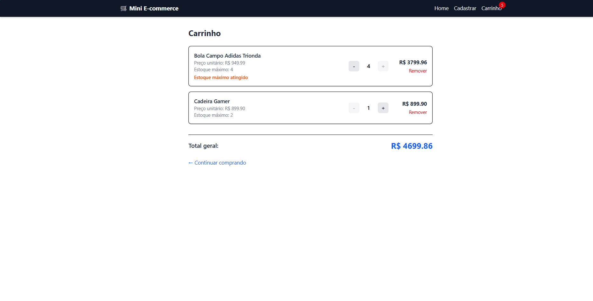
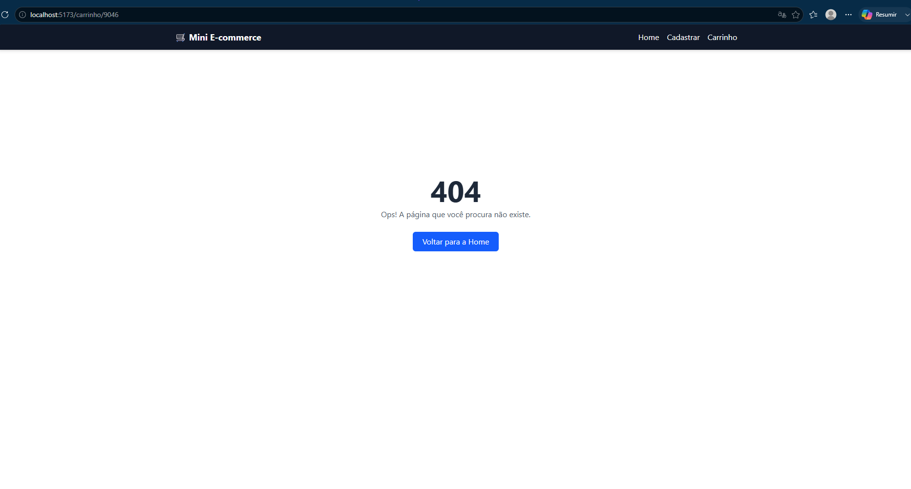
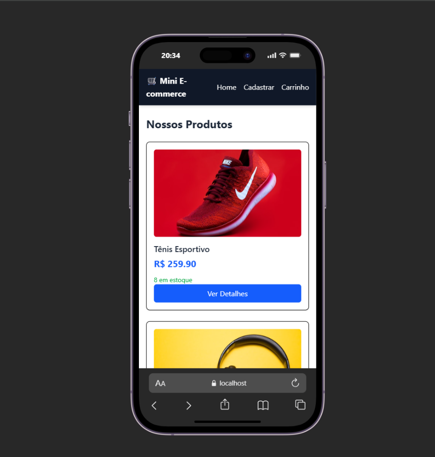

# Mini E-commerce — React + JSON Server

Projeto da disciplina de Desenvolvimento de Aplicação Orientada a Componentes (ULBRA). Entrega individual.

> Por ser entrega individual, conforme as regras do trabalho, os itens de **edição de produto** e **gerenciamento de estoque avançado** foram dispensados.

## Tecnologias

- React + Vite
- React Router DOM
- Context API
- TailwindCSS
- JSON Server (API simulada)

## Estrutura do projeto

src/

├── components/   → Header e ProductCard

├── context/      → CartContext (carrinho global)

├── pages/        → Home, ProductDetail, Cart, ProductForm, NotFound

├── services/     → api.js (funções de fetch)

## Funcionalidades implementadas

- Listagem de produtos consumindo a API (`/produtos`)
- Página de detalhes do produto (`useParams`)
- Carrinho global via Context API (`useContext`), com aumento/diminuição/remoção de itens e total geral
- Bloqueio de quantidade acima do estoque, com mensagem de aviso
- Cadastro de produto com validações (campos obrigatórios, preço e estoque ≥ 0) e foco automático no primeiro campo inválido (`useRef`)
- Exclusão de produto (CRUD: Create, Read, Delete)
- Roteamento com `react-router-dom` e página 404
- Layout responsivo com TailwindCSS

## Uso do Context API

O carrinho é gerenciado em `src/context/CartContext.jsx`. O `CartProvider` envolve toda a aplicação (em `main.jsx`) e armazena o array `cart` (produtos + quantidade). Disponibiliza as funções `addToCart`, `increaseQuantity`, `decreaseQuantity`, `removeFromCart` e o `total`, consumidas via hook customizado `useCart()` nas páginas `ProductDetail`, `Cart` e no `Header`.

## Endpoints da API

| Método | Endpoint         | Uso                  |
|--------|------------------|------------------------|
| GET    | /produtos        | Listar produtos        |
| GET    | /produtos/:id    | Buscar produto por ID  |
| POST   | /produtos        | Criar produto          |
| DELETE | /produtos/:id    | Excluir produto        |

## Como rodar o projeto

```bash
npm install

# Terminal 1 — API simulada
npm run server

# Terminal 2 — aplicação React
npm run dev
```

Acesse `http://localhost:5173`.

## Screenshots

| Tela | Imagem |
|------|--------|
| Home |  |
| Detalhes do produto |  |
| Cadastro preenchido |  |
| Cadastro com erro |  |
| Carrinho |  |
| Estoque máximo atingido |  |
| Página 404 |  |
| Responsivo (mobile) |  |

---
**Autor:** Elian Cardoso
